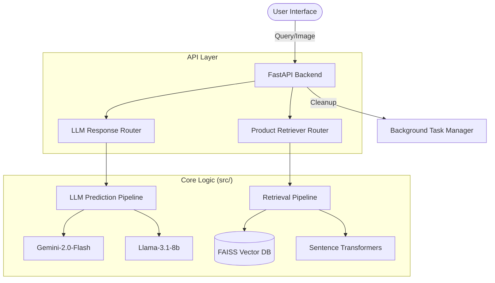

# 🛍️ E-Commerce Chatbot Recommendation System

An AI-powered e-commerce assistant that combines visual intelligence with semantic product discovery. This system allows users to find products through natural language queries and image uploads, powered by FastAPI, LangGraph, and FAISS.

---

## 🚀 Key Features

- **Multimodal Discovery**: Search for products using text or by uploading an image.
- **Visual Intelligence**: Automated image analysis and summary generation using Gemini Pro Vision.
- **Semantic Product Retrieval**: High-precision product suggestions based on visual and textual features.
- **Context-Aware Chat**: Interactive chatbot interface for refining recommendations.
- **Automated Resource Management**: Background task for temporary image cleanup to optimize storage.
- **Production-Ready Backend**: Robust FastAPI architecture with standardized logging and exception handling.

---

## 🏗️ System Architecture



---

## 🛠️ Tech Stack

- **Framework**: FastAPI
- **LLM Orchestration**: LangChain & LangGraph
- **Models**:
  - **Vision**: `gemini-2.0-flash`
  - **Reasoning**: `llama-3.1-8b-instant`
- **Vector Database**: FAISS
- **Embeddings**: Sentence Transformers (`all-MiniLM-L6-v2`)
- **Package Manager**: [uv](https://github.com/astral-sh/uv)
- **Frontend**: HTML/JS (Jinja2 Templates)

---

## 📂 Project Structure

```text
E-Commerce-Chatbot-recommendation/
├── api/
│   ├── ECRecom/          # Retrieval-related API routes
│   ├── LLMResponse/       # LLM chat-related API routes
│   ├── templates/        # Frontend (index.html)
│   └── main.py           # FastAPI application definition
├── src/
│   ├── ECRecom/          # Product retrieval engine (Pipelines, Vector DB)
│   └── LLMResponse/       # LLM reasoning & agentic logic (Nodes, Graphs)
├── artifacts/            # Generated data and vector DB artifacts
├── logs/                 # Execution logs
├── tempImage/            # Temporary storage for uploaded images
├── main.py               # Entry point (Uvicorn runner)
└── pyproject.toml        # Dependency management
```

---

## ⚙️ Installation

1. **Clone the repository**:
   ```bash
   git clone https://github.com/VashuTheGreat/E-Commerce-Chatbot-recommendation.git
   cd E-Commerce-Chatbot-recommendation
   ```

2. **Install dependencies**:
   Using `uv` (recommended):
   ```bash
   uv sync
   ```

3. **Environment Setup**:
   Create a `.env` file based on `.env.example`:
   ```env
   GOOGLE_API_KEY=your_key_here
   GROQ_API_KEY=your_key_here
   ```

---

## 🏃 Usage

### 1. Training Pipeline
Initialize the vector database with your product data:
```bash
uv run src/ECRecom/tests/run_training_pipeline.py
```

### 2. Run the Application
Start the FastAPI server:
```bash
uv run main.py
```
Access the UI at `http://localhost:8080`.

---

## 🔹 License

Distributed under the [MIT License](LICENSE).

---

Made with ❤️ by [VashuTheGreat](https://github.com/VashuTheGreat)
